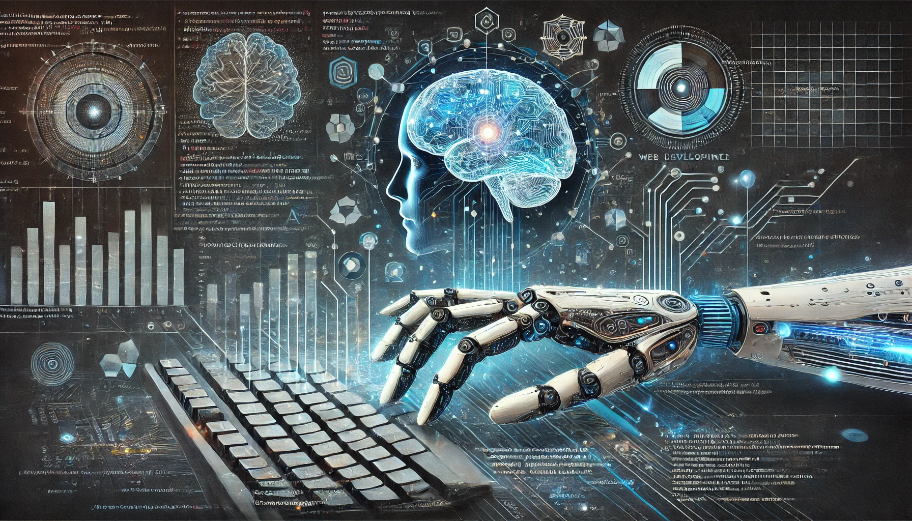

Artificial Intelligence (AI) has already begun reshaping industries, and web development is no exception. In 2024, AI tools and frameworks are becoming essential parts of a developer’s toolkit, helping streamline workflows, enhance user experiences, and improve security. In this blog, we’ll explore how AI is making a profound impact on the world of web development.

---

## 1. AI-Powered Code Generation

One of the most revolutionary impacts AI has had on web development is through code generation tools. Platforms like GitHub Copilot and OpenAI’s Codex are enabling developers to write code faster by suggesting entire blocks of code based on natural language prompts. These AI assistants can understand the context of the code you’re working on and provide real-time recommendations, making the development process more efficient than ever before.

---

## 2. Personalization and Enhanced UX

User experience (UX) is critical in web development, and AI is transforming how developers approach personalization. AI algorithms analyze user behavior and interactions on websites to deliver personalized content, product recommendations, and targeted ads. This level of personalization keeps users engaged and significantly improves conversion rates for businesses.

---

## 3. AI for Automated Testing and Bug Detection

AI is making web development more reliable by automating the testing process. Machine learning models can now analyze codebases, predict where bugs are likely to occur, and even suggest fixes before issues escalate. This proactive approach reduces the time spent on manual debugging and ensures that websites are more secure and stable from the start.

---

## 4. AI in Cybersecurity

Web security is a top concern for developers, and AI is becoming a critical tool in combating cyber threats. AI-powered security tools can detect unusual patterns in traffic or interactions that might indicate a cyberattack. In 2024, more websites are relying on AI to automate threat detection and enhance protection against evolving cyber threats.

---

## Conclusion

As AI continues to evolve, its integration into web development will only become more prominent. From automating repetitive coding tasks to improving website security and personalization, the impact of AI in 2024 is transformative. Developers who embrace these tools will be able to build smarter, faster, and more secure websites, ensuring they stay ahead in this ever-changing field.

---
